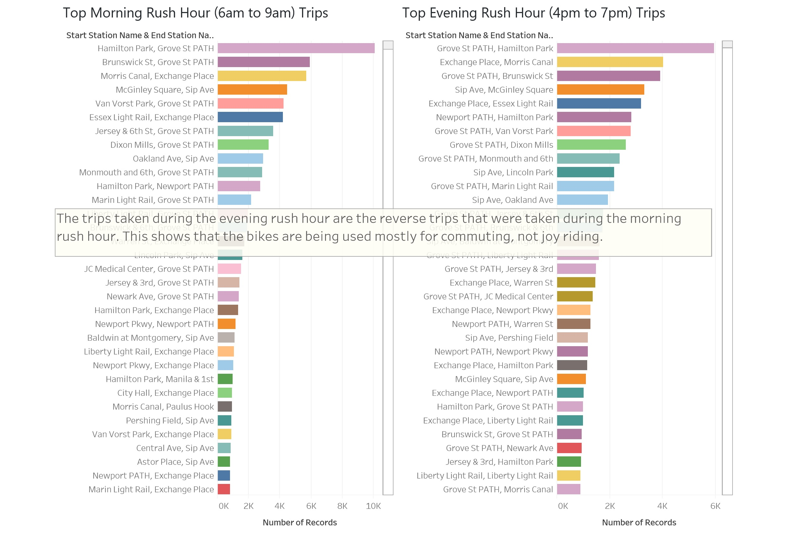

## Unit 1 | Assignment - Citi Bike Analytics

## Background

The trips taken during the evening rush hour are the reverse trips that were taken during the morning rush hour. This shows that the bikes are being used mostly for commuting, not joy riding. For the rest of the conclusions, please download the [New York Citi Bike project pdf](https://github.com/danielron/CitiBikeTableau/blob/master/CitiBike.pdf) or the Tableau [New York Citi Bike project package file](https://github.com/danielron/CitiBikeTableau/blob/master/CitiBike.twbx)      

